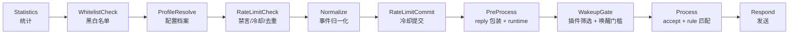
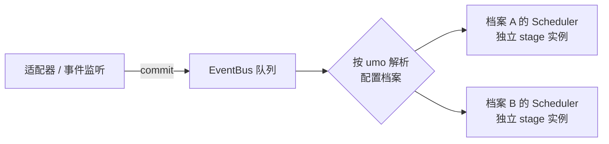

# 阶段 2：消息流水线

> 上游：[`01-plugin-contract.md`](./01-plugin-contract.md) · 下游：[`03-engineering.md`](./03-engineering.md)
> 参考实现：`astrbot/core/pipeline/{stage,stage_order,scheduler,bootstrap,context}.py`、`astrbot/core/event_bus.py`

## 1. 目标

把 `lib/plugins/loader.js` 里 `deal()` 的过程式流程，替换为**可注册、可排序、可中断的 Stage 流水线**，并引入事件总线让"平台产生事件"与"流水线消费事件"解耦。

收益：

1. 新增横切策略只需新增一个 Stage 文件，不改核心；
2. 阶段之间的顺序在一处集中声明并可自检（漏注册立即报错，而不是静默失效）；
3. `setLimit` 这类"处理完成后才执行"的逻辑，天然落在洋葱模型的后置钩子上；
4. 多账号/多配置档案各自拥有独立的阶段实例（限流计数、冷却表不再互相污染）。

---

## 2. 现状：`deal()` 的隐式流程

`lib/plugins/loader.js` 中 `deal(e)` 的实际顺序：

| 序 | 调用 | 说明 |
|---|---|---|
| 1 | `this.count(e, "receive", e.message)` | 统计 |
| 2 | `if (!this.checkBlack(e)) return` | 用户/群黑白名单（读 `cfg.getOther()`） |
| 3 | `const groupCfg = cfg.getGroup(e.self_id, e.group_id)` | 取群配置 |
| 4 | `if (!this.checkLimit(e, groupCfg)) return` | 禁言检查 + 群冷却 + 单人冷却 + 1 秒同文去重 |
| 5 | `this.dealEvent(e, groupCfg)` | **事件归一化**：拼 `e.msg`、`e.img`、`e.atBot`、`e.isMaster`、`e.logText`，剥离 `botAlias`，计算 `e.only_reply_at` |
| 6 | `if (e.only_reply_at) this.setLimit(e, groupCfg)` | 冷却提交 |
| 7 | `this.reply(e)` | **包装** `e.reply`：注入 at/引用、异常兜底、定时撤回 |
| 8 | `await Runtime.init(e)` | 注册 runtime |
| 9 | 构建 `priority` 列表 | `checkDisable` + `filtEvent` 双重过滤 |
| 10 | context hook 循环 | `getContext()` 两段合并，命中即 `return`（返回 `"continue"` 则继续） |
| 11 | `if (!e.only_reply_at) return` | 唤醒门槛 |
| 12 | 游戏前缀归一化 | `srReg` / `zzzReg` → `e.game` + `isSr`/`isGs` getter |
| 13 | `accept()` 阶段 | 第一个返回真值的插件 `break`；返回 `"return"` 直接返回 |
| 14 | `rule` 匹配阶段 | `filtEvent` → `reg.test(e.msg)` → `filtPermission` → 执行 `fnc`；`res === false` 继续，否则 `return` |

### 2.1 暴露出的三个具体问题

**问题 A：横切逻辑与核心耦合。** 第 2、4、6 步都是策略，但写死在核心文件里，插件与第三方无法替换或扩展。

**问题 B：`setLimit` 的位置靠"人工插入"维持。** 它必须在"处理完成"之后、"回复"之前执行。当前是靠第 5/6/7 步的行序保证的——任何一次顺序调整都可能破坏语义，且没有测试能发现。

**问题 C：冷却表按 `group_id` 而非 `bot:group` 建键。**

```js
// lib/plugins/loader.js
if (config.groupCD && this.groupCD[e.group_id]) return false          // 缺 self_id
if (config.singleCD && this.singleCD[`${e.group_id}.${e.user_id}`])   // 缺 self_id
```

对比同文件里 `msgThrottle` 的键是包含 `self_id` 的：

```js
const msgId = `${e.self_id}:${e.user_id}:${e.raw_message}`
```

后果：同一个群里挂了两个 bot 账号时，A 账号触发群冷却会让 B 账号也被静默拦截。这在多账号场景下是真实可见的行为缺陷。

### 2.2 三处位置敏感的相邻关系（必须在实现中显式保留）

| # | 约束 | 依据 | 若违反 |
|---|---|---|---|
| a | `checkLimit`（第 4 步）必须在 `dealEvent`（第 5 步）**之前** | `checkLimit` 读 `e.isPrivate`，而该字段只在 `dealEvent` 中赋值；私聊消息在第 4 步时 `e.isPrivate === undefined`，因此**不会**走 `if (!e.message \|\| e.isPrivate) return true` 的早退分支，而是继续走到 `msgThrottle` 去重 | 把归一化提前到限流之前，私聊将跳过 1 秒同文去重，行为静默改变 |
| b | `setLimit` 必须在插件执行**之前** | 见上方「问题 B」 | 插件长时间渲染期间，群内其他消息不再被冷却拦截 |
| c | `if (!e.only_reply_at) return`（第 11 步）在 context hook（第 10 步）**之后** | 原代码行序 | 把唤醒门槛提前会导致 `getContext()` 钩子在不该运行的场景下少跑一次，插件的状态机会错乱 |

结论：**流程拆分不是顺序中立的**。每一处相邻关系都需要在代码里加注释，并在阶段 0 录制的事件样本上做逐决策点对比。

---

## 3. 目标 Stage 序列



| # | Stage | 对应 `deal()` 步骤 | 是否洋葱（是否 `yield`） |
|---|---|---|---|
| 1 | `StatisticsStage` | 1 | **是**（前钩记接收，后钩记耗时） |
| 2 | `WhitelistCheckStage` | 2 | 否 |
| 3 | `ProfileResolveStage` | 3 | 否 |
| 4 | `RateLimitCheckStage` | 4 | 否 |
| 5 | `NormalizeStage` | 5 | 否 |
| 6 | `RateLimitCommitStage` | 6 | 否 |
| 7 | `PreProcessStage` | 7、8 | 否 |
| 8 | `WakeupGateStage` | 9、10、11 | 否 |
| 9 | `ProcessStage` | 12、13、14 | 否（终止段） |
| 10 | `RespondStage` | 7 的发送部分 | 否（终止段） |

### 3.1 为什么限流被拆成两个 Stage

直觉上「检查 + 提交」应该合并成一个洋葱 Stage（前置检查、`yield`、后置提交）。但现状不支持这样做：

- `setLimit` 的条件是 `e.only_reply_at`，而该字段由第 5 步的 `dealEvent` 计算；
- `setLimit` 必须在第 13/14 步插件执行**之前**生效——否则插件里一段耗时数秒的渲染会让群内其他消息在这段时间内不被冷却拦截。

因此 `RateLimitCheck`（第 4 步）与 `RateLimitCommit`（第 6 步）之间必须夹着 `NormalizeStage`，**不能**用洋葱模型表达。

### 3.2 洋葱机制在 v1 中的定位

v1 只有 `StatisticsStage` 使用洋葱。该机制的价值不在当下而在后续：

- 发送后的定时撤回与消息记录清理（`RespondStage` 之后）；
- 处理耗时落库、异常兜底上报；
- 阶段 4 若引入 LLM 流式输出，需要包住下游才能做流式聚合。

实现成本很低（一个判别函数加一段递归），因此骨架阶段就一并落地，但**不为了用而用**：任何不满足「需要包住下游」的阶段都应写成普通 `async process()`。

### 3.3 未纳入的阶段

AstrBot 有 `ResultDecorateStage`（统一加回复前缀、`t2i`、TTS）。Yunzai 现状没有等价需求（此类装饰分散在各插件里），因此**不新增空实现**。若后续需要统一装饰，它在 `ProcessStage` 与 `RespondStage` 之间即可插入，不改动其他 Stage。

---

## 4. 实现清单

新增文件：

| 文件 | 职责 | 参考 |
|---|---|---|
| `lib/pipeline/stage.js` | `Stage` 基类、`registerStage()`、`registeredStages` 注册表 | `pipeline/stage.py` |
| `lib/pipeline/stage-order.js` | `STAGES_ORDER` 常量 + `assertStageCoverage()` | `pipeline/stage_order.py` |
| `lib/pipeline/scheduler.js` | 按序实例化、洋葱递归、停止传播 | `pipeline/scheduler.py` |
| `lib/pipeline/context.js` | `PipelineContext`（配置档案、插件注册表、存储、日志） | `pipeline/context.py` |
| `lib/pipeline/bootstrap.js` | 显式 `import` 内置 stage 并校验覆盖完整 | `pipeline/bootstrap.py` |
| `lib/pipeline/stages/*.js` | 上表 8 个 Stage 实现 | `pipeline/*/stage.py` |
| `lib/event-bus.js` | 事件队列 + 按会话解析配置档案 + 分派调度器 | `core/event_bus.py` |

改动文件：

| 文件 | 改动 |
|---|---|
| `lib/plugins/loader.js` | `deal()` 改为"入队 + 由 EventBus 分派"；**保留** `deal()` 作为兼容入口（旧代码/插件直接调用它时仍走旧路径或转发到总线） |
| `lib/events/*.js` | 由直接调用 `plugins.deal(e)` 改为 `eventBus.commit(e)` |
| `lib/bot.js` | 初始化时创建 `EventBus`，并在 `exit()` 时优雅关停 |

---

## 5. 洋葱模型：JS 精确实现

AstrBot 的核心机制是：`Stage.process()` 返回**普通协程**或**异步生成器**，调度器据此判断该 Stage 是否包住下游。JS 可以 1:1 复刻。

### 5.1 约定

| 写法 | 返回 | 语义 |
|---|---|---|
| `async process(event) { … }` | `Promise` | 普通阶段，执行完继续下一段 |
| `async *process(event) { …; yield; … }` | `AsyncGenerator` | **洋葱阶段**，`yield` 之后的内容在所有下游阶段跑完后执行 |

关键点：`async *process()` 是生成器函数，调用时**不执行函数体**，直接返回 `AsyncGenerator`；`async process()` 调用时返回已被调度的 `Promise`。两者在语法层面就可判别。

### 5.2 调度器骨架

```js
// lib/pipeline/scheduler.js
function isAsyncIterable(v) {
  return !!v && typeof v[Symbol.asyncIterator] === "function"
}

async function processStages(ctx, event, from = 0) {
  for (let i = from; i < ctx.stages.length; i++) {
    const stage = ctx.stages[i]
    const ret = stage.process(event) // 注意：不能先 await

    if (isAsyncIterable(ret)) {
      for await (const _ of ret) {
        if (ctx.isStopped(event)) break
        await processStages(ctx, event, i + 1)
        if (ctx.isStopped(event)) break
      }
    } else {
      await ret
      if (ctx.isStopped(event)) break
    }
  }
}
```

**易错点（必须在文档与代码注释中标注）**：

- 不能写 `const ret = await stage.process(event)`——`await` 会把 `AsyncGenerator` 与 `Promise` 的差别抹掉，洋葱模型立即失效；
- `for await (const _ of ret)` 的循环次数等于该阶段 `yield` 的次数；写成"多个 `yield`"会导致下游被执行多次；
- 阶段实例必须**有状态地复用**（`initialize()` 只调一次），否则限流计数、缓存等状态会每消息丢失。

### 5.3 中断传播

`ctx.isStopped(event)` 统一判断是否停止。语义对应现状的 `return`：

| 现状 | 目标 |
|---|---|
| `if (!this.checkLimit(e, groupCfg)) return` | `RateLimitCheckStage` 内 `ctx.stop(event)` |
| `if (!this.checkBlack(e)) return` | `WhitelistCheckStage` 内 `ctx.stop(event)` |
| 插件 `reject()` 回调 | `ProcessStage` 内转换为 `ctx.stop(event)` + 记录 `[Handler][Reject]` 日志 |
| 插件命中并返回 | `ctx.stop(event)`（不再继续尝试低优先级插件），保持与现状"命中即停"一致 |

---

## 6. 事件总线与配置档案

现状：`lib/events/*.js` 直接 `this.plugins.deal(e)`，所有账号共用同一份 `groupCD` / `singleCD` / `msgThrottle`。

目标：



- **配置档案（profile）**：沿用 `cfg.getGroup(self_id, group_id)` 的键空间语义，档案 = `self_id`（Bot 账号）+ 群/私聊配置解析结果；
- 每个档案拥有一组**独立的 Stage 实例**，因此 `RateLimitStage` 的冷却表天然以档案为界，问题 C 被顺手修掉（键不再需要手写 `self_id`）；
- 队列消费用 `for await` 串行 + `Promise` 并发控制，避免慢阶段（渲染截图）阻塞整个账号。
  - **注意**：并发度不能简单设为"无限"。现状是同账号消息串行处理，改成并发会改变 `msgThrottle` 去重与插件内部的隐式时序假设。建议 v1 **保持串行**，只做结构改造，把并发留到有实测数据后再开。

---

## 7. 迁移步骤（每步独立可提交、可回滚）

1. **落地骨架，不接线**：新增 `lib/pipeline/*`，实现基类与调度器，用 fake 事件写单测；`deal()` 完全不动。
2. **等价 Stage 实现**：把现状 9 步中的策略逐条翻译成 Stage，每个 Stage 附单测（用阶段 0 录制的事件样本断言输入输出）。
3. **影子运行**：`deal()` 先跑旧逻辑，再把事件喂给新流水线并**只记录不执行**，对比两者在每个决策点的分歧，直到分歧归零。
4. **切换**：`deal()` 改为入队；旧逻辑保留一个版本周期，通过 `bot.legacy_pipeline: false` 开关可回退。
5. **清理**：删除旧路径与开关，补 Stage 的集成测试。

> 第 3 步是整个阶段最关键的保障：它把"重构不改变行为"从信念变成可观测的对比结果。

---

## 8. 验收标准

- [ ] `assertStageCoverage()` 在漏注册/多注册时抛错，并有单测覆盖
- [ ] 调度器的洋葱语义有专门单测：给定三段（普通、洋葱、普通），断言执行顺序为 `pre1 → pre2 → pre3 → post2`
- [ ] `RateLimitCheckStage` / `RateLimitCommitStage` 单测覆盖：群冷却、单人冷却、1 秒同文去重、`only_reply_at` 为假时不提交冷却
- [ ] §2.2 的三处位置敏感约束均有注释标注，且有专门的顺序回归测试
- [ ] 阶段 0 录制的全部事件样本，在新流水线下的**决策序列**与旧 `deal()` 完全一致
- [ ] `lib/plugins/loader.js` 中 `deal()` 的过程式策略代码已被删除，文件仅剩加载与调度职责
- [ ] 多账号场景：两个 `self_id` 在同群，A 触发冷却后 B 仍正常响应（新增回归测试）
- [ ] 启动耗时与阶段 0 基线相比无显著回退

---

## 9. 风险

| 风险 | 概率 | 影响 | 对策 |
|---|---|---|---|
| 洋葱模型被误用（`await` 抹平差别） | 中 | 高 | 骨架中加断言 + 专门单测；`processStages` 处写显式注释 |
| 阶段实例被意外重建，状态丢失 | 中 | 高 | `initialize()` 只在启动时调用；单测断言实例身份在多次事件间保持 |
| 行为出现细微差异且难以定位 | 中 | 高 | 影子运行阶段（第 7 节第 3 步）逐决策点对比 |
| 旧插件直接调用 `PluginsLoader.deal()` | 低 | 中 | 保留 `deal()` 作为兼容入口，内部转发到流水线 |
| 引入并发后时序混乱 | 中 | 高 | v1 强制串行；并发作为独立的后续实验，需单独 ADR |
| 与 `Runtime.init(e)` 的耦合 | 中 | 中 | 把 `Runtime` 注册放入 `PreProcessStage`，并为其补单测后再切换 |
