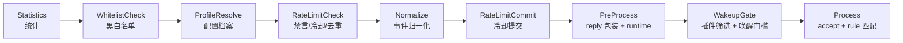
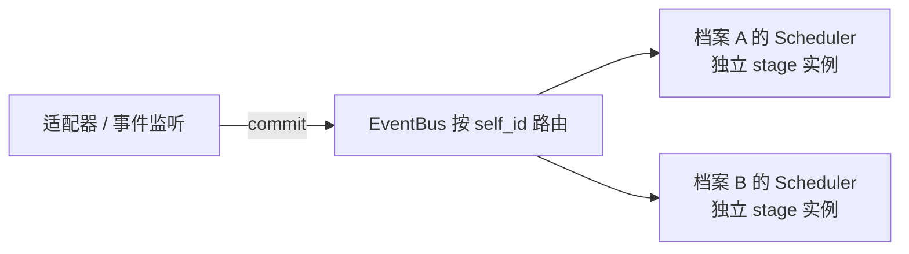

# 阶段 2：消息流水线

> 上游：[`01-plugin-contract.md`](./01-plugin-contract.md) · 下游：[`03-engineering.md`](./03-engineering.md)
> 参考实现：`astrbot/core/pipeline/{stage,stage_order,scheduler,bootstrap,context}.py`、`astrbot/core/event_bus.py`

## 1. 目标

把 `lib/plugins/loader.js` 里 `deal()` 的过程式流程，替换为**可注册、可排序、可中断的 Stage 流水线**，并引入事件总线让"平台产生事件"与"流水线消费事件"解耦。

收益：

1. 新增横切策略只需新增一个 Stage 文件，不改核心；
2. 阶段之间的顺序在一处集中声明并可自检（漏注册立即报错，而不是静默失效）；
3. `setLimit` 这类“处理完成后才执行”的逻辑有了明确的位置（见 §3.1：它必须拆成独立阶段，而不是靠行序）；
4. 多账号/多配置档案各自拥有独立的阶段实例（限流计数、冷却表不再互相污染）。

---

## 2. 现状：`deal()` 的隐式流程

`lib/plugins/loader.js` 中 `deal(e)` 的实际顺序：

| 序 | 调用 | 说明 |
|---|---|---|
| 1 | `this.count(e, "receive", e.message)` | 统计 |
| 2 | `if (!this.checkBlack(e)) return` | 用户/群黑白名单（读 `cfg.getOther()`） |
| 3 | `const groupCfg = cfg.getGroup(e.self_id, e.group_id)` | 取群配置 |
| 4 | `if (!this.checkLimit(e, groupCfg)) return` | 禁言检查 + 群冷却 + 单人冷却 + 1 秒同文去重 |
| 5 | `this.dealEvent(e, groupCfg)` | **事件归一化**：拼 `e.msg`、`e.img`、`e.atBot`、`e.isMaster`、`e.logText`，剥离 `botAlias`，计算 `e.only_reply_at` |
| 6 | `if (e.only_reply_at) this.setLimit(e, groupCfg)` | 冷却提交 |
| 7 | `this.reply(e)` | **包装** `e.reply`：注入 at/引用、异常兜底、定时撤回 |
| 8 | `await Runtime.init(e)` | 注册 runtime |
| 9 | 构建 `priority` 列表 | `checkDisable` + `filtEvent` 双重过滤 |
| 10 | context hook 循环 | `getContext()` 两段合并，命中即 `return`（返回 `"continue"` 则继续） |
| 11 | `if (!e.only_reply_at) return` | 唤醒门槛 |
| 12 | 游戏前缀归一化 | `srReg` / `zzzReg` → `e.game` + `isSr`/`isGs` getter |
| 13 | `accept()` 阶段 | 第一个返回真值的插件 `break`；返回 `"return"` 直接返回 |
| 14 | `rule` 匹配阶段 | `filtEvent` → `reg.test(e.msg)` → `filtPermission` → 执行 `fnc`；`res === false` 继续，否则 `return` |

### 2.1 暴露出的三个具体问题

**问题 A：横切逻辑与核心耦合。** 第 2、4、6 步都是策略，但写死在核心文件里，插件与第三方无法替换或扩展。

**问题 B：`setLimit` 的位置靠"人工插入"维持。** 它必须在"处理完成"之后、"回复"之前执行。当前是靠第 5/6/7 步的行序保证的——任何一次顺序调整都可能破坏语义，且没有测试能发现。

**问题 C：冷却表按 `group_id` 而非 `bot:group` 建键。**

```js
// lib/plugins/loader.js
if (config.groupCD && this.groupCD[e.group_id]) return false          // 缺 self_id
if (config.singleCD && this.singleCD[`${e.group_id}.${e.user_id}`])   // 缺 self_id
```

对比同文件里 `msgThrottle` 的键是包含 `self_id` 的：

```js
const msgId = `${e.self_id}:${e.user_id}:${e.raw_message}`
```

后果：同一个群里挂了两个 bot 账号时，A 账号触发群冷却会让 B 账号也被静默拦截。这在多账号场景下是真实可见的行为缺陷。

### 2.2 三处位置敏感的相邻关系（必须在实现中显式保留）

| # | 约束 | 依据 | 若违反 |
|---|---|---|---|
| a | `checkLimit`（第 4 步）必须在 `dealEvent`（第 5 步）**之前** | `checkLimit` 读 `e.isPrivate`，而该字段只在 `dealEvent` 中赋值；私聊消息在第 4 步时 `e.isPrivate === undefined`，因此**不会**走 `if (!e.message \|\| e.isPrivate) return true` 的早退分支，而是继续走到 `msgThrottle` 去重 | 把归一化提前到限流之前，私聊将跳过 1 秒同文去重，行为静默改变 |
| b | `setLimit` 必须在插件执行**之前** | 见上方「问题 B」 | 插件长时间渲染期间，群内其他消息不再被冷却拦截 |
| c | `if (!e.only_reply_at) return`（第 11 步）在 context hook（第 10 步）**之后** | 原代码行序 | 把唤醒门槛提前会导致 `getContext()` 钩子在不该运行的场景下少跑一次，插件的状态机会错乱 |

结论：**流程拆分不是顺序中立的**。每一处相邻关系都需要在代码里加注释，并在阶段 0 录制的事件样本上做逐决策点对比。

---

## 3. 目标 Stage 序列



| # | Stage | 对应 `deal()` 步骤 |
|---|---|---|
| 1 | `StatisticsStage` | 1（耗时由 EventBus 在 `execute()` 外包一层测） |
| 2 | `WhitelistCheckStage` | 2 |
| 3 | `ProfileResolveStage` | 3 |
| 4 | `RateLimitCheckStage` | 4 |
| 5 | `NormalizeStage` | 5 |
| 6 | `RateLimitCommitStage` | 6 |
| 7 | `PreProcessStage` | 7、8 |
| 8 | `WakeupGateStage` | 9、10、11 |
| 9 | `ProcessStage` | 12、13、14（终止段） |

**只有 9 个阶段，不多不少**：`deal()` 的 14 个步骤全部有归属，`RespondStage` 被去掉——发送是通过
`PreProcessStage` 包装的 `e.reply` 完成的，不存在一个独立的“发送阶段”（见 §3.4）。

### 3.1 为什么限流被拆成两个 Stage

直觉上「检查 + 提交」应该合并成一个洋葱 Stage（前置检查、`yield`、后置提交）。但现状不支持这样做：

- `setLimit` 的条件是 `e.only_reply_at`，而该字段由第 5 步的 `dealEvent` 计算；
- `setLimit` 必须在第 13/14 步插件执行**之前**生效——否则插件里一段耗时数秒的渲染会让群内其他消息在这段时间内不被冷却拦截。

因此 `RateLimitCheck`（第 4 步）与 `RateLimitCommit`（第 6 步）之间必须夹着 `NormalizeStage`，**不能**用洋葱模型表达。

### 3.2 没有洋葱模型（刻意）

阶段一律是顺序执行、返回 Promise 的普通函数。**不实现洋葱模型**，三条理由：

| # | 理由 |
|---|---|
| 1 | **在 Yunzai 里零消费者**。原计划只有 `StatisticsStage` 用它做耗时统计，而“整条流水线跑了多久”是**调度器**职责——`EventBus` 包住 `execute()` 就能测，不该由流水线内部承担 |
| 2 | **参考实现已废弃该设计**。AstrBot RFC [#1948](https://github.com/AstrBotDevs/AstrBot/issues/1948) 把 pipeline 重构为 chain/workflow，明确写着「此次重构将替代现有的洋葱模型，所有基于该模型的功能模块均需重写」；其更新说明是「实际落地为 chain 架构，简化了原有执行模型」——有序链正是本设计当前的形式 |
| 3 | **该机制自带坑**。参考实现的洋葱分支在 `async for` 结束后，外层 `for` 会继续到 `i + 1`，导致洋葱阶段下游的所有阶段被**执行第二遍**（其 `content_safety_check/stage.py` 在内容拦截路径上就会触发）。对 Yunzai 而言这等于“同一条消息里插件被执行两次” |

关于第 2 条需要说清楚：**“采纳 #1948 的设计”与“实现洋葱模型”是矛盾的**。
该 RFC 的落地形态就是“有序链 + 节点”，并不包含洋葱；完整 workflow 引擎（条件边、会话变量、会话锁）属于其 v5.x milestone，
PR #4960 至今仍为 `[WIP]`，且其自列的已知问题包括“内置命令系统需要重新设计”“WebUI 需重构”。
对 Yunzai 而言那等同于重写插件生态，直接违反 [`PLAN.md`](./PLAN.md) 的非目标与 ADR-003。

### 3.3 为将来预留的扩展点

如果将来确实需要「条件边 / 会话变量 / 会话锁」这类图状编排：

- **Stage 仍是行为的唯一单元**，插件契约（`rule` / `handler` / `accept`）不需要改动；
- **顺序决策只存在于两处**——`stage-order.js` 的声明与 `scheduler.js` 的 `processStages`，换引擎只动这两个文件；
- **会话变量已有雏形**：`ctx.stateOf(event)` 就是每事件的键值状态；
- **会话隔离已具备**：`PipelineContext` 按配置档案隔离（每档案一组阶段实例），`EventBus` 的串行队列等价于“会话锁”。

但**现在不做**：Yunzai 当前的痛点是“横切策略硬编码在 `deal()` 里”与“插件靠 priority 魔数调度”，固定有序链已经解决；引入图状引擎属于提前抽象。

### 3.4 未纳入的阶段

两个阶段存在过“预留”的说法，最终都**不实现**，理由是同一个：为不存在的行为建空实现。

| 阶段 | 为何不实现 |
|---|---|
| `ResultDecorateStage`（AstrBot 有） | 统一加回复前缀、`t2i`、TTS。Yunzai 现状没有等价需求，此类装饰分散在各插件里 |
| `RespondStage` | 发送并非一个阶段：`PreProcessStage` 包装出的 `e.reply` 就是发送入口，插件在处理过程中直接调它。加一个空的终止段只是把“顺序列表末尾”换个写法，不产生任何行为 |

若后续需要统一装饰，它在 `ProcessStage` **之前**插入即可（那时 `e.reply` 已被包装，装饰器可以挂在它上面），不改动其他 Stage。

---

## 4. 实现清单

新增文件：

| 文件 | 职责 | 参考 |
|---|---|---|
| `lib/pipeline/stage.js` | `Stage` 基类、`registerStage()`、`registeredStages` 注册表 | `pipeline/stage.py` |
| `lib/pipeline/stage-order.js` | `STAGES_ORDER` 常量 + `assertStageCoverage()` | `pipeline/stage_order.py` |
| `lib/pipeline/scheduler.js` | 按序实例化、顺序执行、停止传播 | `pipeline/scheduler.py`（**仅参考顺序声明，不采纳其洋葱机制**，见 §3.2） |
| `lib/pipeline/context.js` | `PipelineContext`（配置档案、插件注册表、存储、日志） | `pipeline/context.py` |
| `lib/pipeline/bootstrap.js` | 显式 `import` 内置 stage 并校验覆盖完整 | `pipeline/bootstrap.py` |
| `lib/pipeline/stages/*.js` | 上表 9 个 Stage 实现 | `pipeline/*/stage.py` |
| `lib/event-bus.js` | 事件队列 + 按会话解析配置档案 + 分派调度器 | `core/event_bus.py` |

改动文件：

| 文件 | 改动 |
|---|---|
| `lib/listener/listener.js` | 新增 `this.events`（指向 `EventBus` 单例）；`this.plugins` **保留**——旧监听器与插件可能直接调 `deal()` |
| `lib/events/message.js` / `notice.js` / `request.js` | `this.plugins.deal(e)` → `this.events.commit(e)`；**同样不 `await`**（见 §6） |
| `lib/plugins/loader.js` | `deal()` **一行未改**，作为旧路径与兼容入口保留到第 5 步清理 |
| `lib/bot.js` | **不需要改**。`EventBus` 是懒初始化的单例（档案按 `self_id` 首次出现时才建），没有启动/退出钩子要挂 |

---

## 5. 调度器实现

### 5.1 只有一种阶段：顺序执行的 Promise

```js
// lib/pipeline/scheduler.js
export async function processStages(ctx, event, from = 0) {
  for (let i = from; i < ctx.stages.length; i++) {
    const stage = ctx.stages[i]
    const produced = stage.process(event)

    // 误用已废弃的洋葱写法时直接抛错，而不是静默什么都不做
    if (isAsyncGenerator(produced))
      throw new Error(`${stage.constructor.name}.process() 返回了异步生成器…`)

    await produced
    if (ctx.isStopped(event)) break
  }
}
```

**为什么保留那个判别**：`await` 一个异步生成器**不会**执行它的函数体，只会拿到生成器对象。
如果没有这个检查，一个照抄旧文档写成 `async *process()` 的阶段会表现为“什么都没做”，排查成本极高。
把它变成显式错误只需要三行，且已有单测覆盖。

**易错点**：阶段实例必须**有状态地复用**（`initialize()` 只在启动时调一次），
否则限流计数、缓存等状态会每消息丢失。

### 5.2 中断传播

`ctx.isStopped(event)` 统一判断是否停止。语义对应现状的 `return`：

| 现状 | 目标 |
|---|---|
| `if (!this.checkBlack(e)) return` | `WhitelistCheckStage` 内 `ctx.stop(event)` |
| `if (!this.checkLimit(e, groupCfg)) return` | `RateLimitCheckStage` 内 `ctx.stop(event)` |
| context hook 返回非 `"continue"` 时 `return` | `WakeupGateStage` 内 `ctx.stop(event)` |
| 插件命中并返回 | `ProcessStage` 内 `ctx.stop(event)`（不再继续尝试低优先级插件），保持与现状“命中即停”一致 |
| 规则命中但处理器返回 `false` | **不**停止，`continue` 到同一插件的下一条规则（对应现状的 `continue`） |

> 现状 **没有** `reject()` 回调这回事（`loader.js` 里搜不到）。§5.2 早先的草稿里写过它，那是照搬参考设计的臆测，已删。

---

## 6. 事件总线与配置档案

现状：`lib/events/*.js` 直接 `this.plugins.deal(e)`，所有账号共用同一份 `groupCD` / `singleCD` / `msgThrottle`。

目标：



- **配置档案（profile）**：沿用 `cfg.getGroup(self_id, group_id)` 的键空间语义，档案 = `self_id`（Bot 账号）；
- 每个档案拥有一组**独立的 Stage 实例**，因此 `RateLimitCheckStage` 的冷却表天然以档案为界，问题 C 被顺手修掉
  （键仍需写 `self_id`，因为同一用户的去重键要区分是哪个 bot 收到的）；
- 档案**懒创建**（`self_id` 只有连上来才知道），每个档案的首条消息多一次 `await`（等阶段实例化）；
  之后走同步快路径——`commit()` 在第一个 `await` 之前就调用了 `execute()`，
  于是流水线前缀与 `Bot.emit` 仍处于同一个 tick。

### 6.1 没有队列（对计划的一次修正）

本节早先写着"队列消费用 `for await` 串行"，并假设"现状是同账号消息串行处理"。
**这个假设是错的**，因此实现里**刻意没有排队**：

- `Bot.em()` 走的是**同步**的 `EventEmitter.emit`，而 `lib/events/*.js` 的 `execute()` 并没有
  `await` 返回值——旧 `deal()` 的 Promise 是**被丢弃**的，多条消息本来就并发执行；
- 只有 `deal()` 里第一个 `await` **之前**的那段前缀是每事件原子的，
  而限流检查（`checkLimit`）与提交（`setLimit`）恰好都在那段前缀里，
  所以限流本身没有被并发破坏；
- 因此"v1 保持串行"**不是**保持现状，而是**引入**行为变更：插件处理器会从并发变成串行。
  慢插件会阻塞同账号的其他消息，而插件的隐式时序假设也可能依赖并发——
  这需要单独的 ADR 与实测数据，不能当作"结构改造"顺带做掉。

插入点已经留好：将来要排队就把 `commit()` 里的 `scheduler.execute(event)` 换成入队 + 由泵消费，
阶段代码一行不用改。

### 6.2 回退开关

`config/config/bot.yaml` 的 `legacy_pipeline: true` 回退到旧 `deal()`；**缺省走新流水线**。
开关是**每次提交时**读的（`cfg` 对 yaml 有缓存，不引入额外 IO），所以支持热更新；
状态变化时会打一条日志（`使用新版消息流水线` / `已启用旧版消息流水线`），
避免“用户以为开了开关其实没开”这类最难排查的情况。

---

## 7. 迁移步骤（每步独立可提交、可回滚）

1. **落地骨架，不接线**：新增 `lib/pipeline/*`，实现基类与调度器，用 fake 事件写单测；`deal()` 完全不动。
2. **等价 Stage 实现**：把现状 9 步中的策略逐条翻译成 Stage，每个 Stage 附单测（用阶段 0 录制的事件样本断言输入输出）。
3. **影子运行**：`deal()` 先跑旧逻辑，再把事件喂给新流水线并**只记录不执行**，对比两者在每个决策点的分歧，直到分歧归零。
4. **切换**：`deal()` 改为入队；旧逻辑保留一个版本周期，通过 `bot.legacy_pipeline: false` 开关可回退。
5. **清理**：删除旧路径与开关，补 Stage 的集成测试。

> 第 3 步是整个阶段最关键的保障：它把"重构不改变行为"从信念变成可观测的对比结果。

### 7.1 进度

| 步 | 内容 | 状态 |
|---|---|---|
| 0a | 手工事件 fixture + 事件/配置夹具（阶段 0 遗留的前置任务） | ✅ 已完成：`tests/fixtures/events/` 14 条样本 + `tests/helpers/{events,config,pipeline}.js` |
| 1 | 骨架落地（不接线）：`stage.js` / `stage-order.js` / `context.js` / `scheduler.js` | ✅ 已完成 |
| 2 | 等价 Stage 实现（9 个） | ✅ 已完成：9 个全部落地，共 150 个用例 |
| 2a | `dispatch.js` 纯函数集 | ✅ 已完成：`matchesEvent` / `normalizeText` / `checkPermission` / `isPluginEnabled` / `shouldReplyOnlyAt` / `matchId` / `truncateForLog` / `asChatTarget` / `instantiate` / `callables` / `replyOf` |
| 3 | 影子运行对比 | ✅ 已完成：43 个场景，旧 `deal()` 与新流水线的可观测结果**逐项一致**（`tests/unit/pipeline/shadow.test.js`） |
| 3a | `lib/pipeline/bootstrap.js` | ✅ 已完成：显式 import 全部 9 个 stage + `bootstrapPipeline()` 校验并排序；`scheduler.initialize()` 改为走它 |
| 4 | EventBus 落地 + 切换（`deal()` → `commit()`） | ✅ 已完成：`lib/event-bus.js`（按 `self_id` 分档案、懒初始化、`legacy_pipeline` 回退开关）+ 3 个事件监听接线 |
| 4a | 真机验证（stdin 适配器端到端） | ✅ 已完成：新路径 + 回退路径各跑通，并**揪出 3 个只在真机暴露的缺陷**（见 §7.4 第 7-9 条） |
| 5 | 清理旧路径 | ⬜ 未开始：`deal()` 与其过程式策略代码仍在

### 7.2 影子运行怎么做的

`tests/unit/pipeline/shadow.test.js` 两侧**都跑真实实现**，只替身化外部依赖
（`Runtime.init` 会拉 puppeteer）。场景表在 `shadow-scenarios.js`，共 43 个，覆盖：

插件筛选（`disable` / `enable` / `event` 声明缺失或不匹配）、`accept`、`getContext`、
唤醒门槛（三种触发方式 + "未唤醒时钩子仍执行"）、权限（master / admin / owner × 允许与拦截）、
黑白名单（用户与群 × 黑与白）、禁言与全员禁言、群冷却 / 单人冷却 / 同文去重、
归一化细节（星铁 / 绝区零 / 斜杠前缀 / 多段消息 / 引用与文件 / notice）。

比较的是**可观测结果**而不是"停在哪一步"——旧 `deal()` 无法从外部观察内部的 `return`，
但所有分支的后果都可观测：方法调用序列、发出的消息、计数调用、归一化后的字段。

三条防"假阳性"的措施（都有用例）：
1. **防退化**：断言确实有 ≥8 个场景执行到处理器、≥3 个场景发出消息、≥30 个场景计了 `receive`。
   否则"对比通过"可能只是"两边都在第一步就退出"。
2. **防不敏感**：把黑名单换掉后结果必须不同。
3. **防污染**：两侧各自用新实例/新上下文，重复运行结果必须完全一致。

### 7.3 影子运行覆盖不到的东西（测试方法学的边界）

影子运行比的是**决策逻辑**。以下不在其射程内，是它的固有边界（不是"以后补"）：

- 真实的 `Runtime.init()`（被替身化了，它涉及 puppeteer 与各插件的缓存注册）；
- redis 计数写入（`loader.count` 被替身化，两侧共用替身所以能验证"何时调用"，不能验证写入了什么）；
- 定时任务、适配器生命周期、插件热重载；
- **插件内部对 `this` 的依赖**——这一条是真正吃过亏的：夹具一开始全用箭头函数，
  于是"处理器/`getContext` 必须以插件实例为 `this` 调用"这个约束整类都测不出来，
  最后是 §7.5 的真机验证揪出来的。教训：夹具要照真实插件的写法写，不能只图方便。

> 这些都是"影子运行再怎么写也盖不住"的东西，所以它**不能替代真机验证**——
> 两者是互补的，不是重复的。

---

### 7.4 落地时确认的行为细节（写代码时才看清的）

这些点在原计划里没写对，是实现阶段逐条对照 `deal()` 才确认的：

| # | 事实 | 影响 |
|---|---|---|
| 1 | `res === false` 的语义是 `continue`——**继续尝试同一插件的下一条规则**，不是终止 | `ProcessStage` 用 `runHandler()` 的布尔返回值区分“继续”与“停止”；写错会静默改变插件链的匹配行为 |
| 2 | 没有 `event` 声明的插件会被 `filtEvent` 直接排除（`if (!v.event) return false`） | 所有真实插件都声明了 `event`；测试夹具必须显式声明，否则会被误判为“筛选逻辑坏了” |
| 3 | `priority` 条目的形状是 `{ plugin: 实例, class: 构造器 }`，不是“声明 + 类” | 新实例由 `new class(e)` 生成，`name` / `rule` / `accept` 必须在原型或构造函数里才有 |
| 4 | `deal()` 的唤醒门槛在 `getContext()` 之后，且 `getContext()` **无条件调用两次** | 顺序敏感的第三处约束，已写进 `stage-order.js` 与阶段注释 |
| 5 | `e.only_reply_at` 由 `NormalizeStage` 算出，而 `RateLimitCheckStage` 读 `e.isPrivate`——该字段此时**尚未赋值** | 私聊不会走限流早退分支。测 `RateLimitCheckStage` 时不能顺手跑归一化，否则会“修正”掉真实行为 |
| 6 | `Object.defineProperty(e, "isSr", …)` 未声明 `configurable` | 同一事件对象上重复执行 `ProcessStage` 会抛 TypeError。**影子运行必须用事件副本**，已写成用例锁定 |
| 7 | `checkDisable(Object.assign(i.plugin, { e }), groupCfg)` 会把每事件的 `e` 写进**共享的**插件实例上 | **这一步是契约，不是副作用**（见下方更正）。写法上仍用 `isPluginEnabled(pluginName, groupCfg)` 取值传参，但 `e` 必须照挂 |
| 8 | `plugin.getContext()` 内部会经由 `conKey()` 读 `this.e.self_id` / `this.e.user_id` / `this.e.group_id` | 它**同时要求**两件事：以插件实例为 `this` 调用，且实例上已挂好本次事件的 `e`。缺任何一个都会抛 `Cannot read properties of undefined (reading 'conKey')` |
| 9 | 命令处理器（如 miao-plugin 的 `components/App.js`）普遍用 `this.e` 取事件 | 处理器同样必须作为**方法调用**，拆成裸函数会抛 `... (reading 'e')` |

第 7 条曾在本文里被写成“有意的行为收紧（去掉对共享对象的每事件写入），行为等价”。
**那个结论是错的**，第 7、8、9 条实际上属于同一件事，而且都是真机验证才暴露出来的：

> `getContext()` 与处理器都依赖 `this` 指向插件实例，而 `this.e` 又依赖 `Object.assign` 那行先执行。
> 当时把 `Object.assign` 当成“可省的副作用”删掉，同时又把 `getContext` 与处理器拆成裸函数调用，
> 结果是旧 `deal()` 能跑、新流水线每一条命令都报错。

**两道防线都失效了，原因值得记下**：

- `dispatch.js` 里的纯函数单测全过——它们没覆盖“调用时的 `this`”这件事；
- 影子运行也全过——因为夹具里的 `getContext` / 处理器都写成了箭头函数，**不碰 `this`**。
  影子运行能发现什么，取决于夹具有多像真实插件；夹具太“礼貌”就会漏掉整个约束类别。

因此修完代码以外还做了三件事：夹具改成照真实形态写（用 `this.e`）、补上对应单测、
把“依赖 `this.e`”的两个场景加进影子运行场景表。

### 7.5 本阶段落地的实测结果

- `pnpm test`：**342 个用例全通**（阶段 2 贡献 233 个）；
- `pnpm lint` / `pnpm lint:eslint` / `pnpm typecheck`：16 error / 9 warning / **270 处**
  （比基线 273 少 3，因为顺手修掉了 `listener.js` 的 3 条 JSDoc 错误）；
- 真实启动冒烟：27 插件 / 5 监听 / 7 适配器 / 零告警，与阶段 0 基线一致。

**真机端到端验证**（这一步不能省，原因见 §7.4）：

用 `plugins/adapter/stdin.js` 直接喂消息，走的是真实 27 插件注册表：

| 场景 | 结果 |
|---|---|
| 新流水线 + `#帮助` | miao-plugin 渲染 364KB 图片、发送成功、`[完成431]` |
| 新流水线 + `#状态` | 正常，且 `消息统计` 递增 —— 证明 `StatisticsStage` 的 redis 计数链路通 |
| 翻转 `legacy_pipeline: true`（热更新，无需重启） | 日志 `已启用旧版消息流水线`，`#状态` 依旧正常 |
| 翻回默认 | 日志 `使用新版消息流水线`，恢复正常 |

真机验证一次就揪出 3 个单测与影子运行都没发现的缺陷（§7.4 第 7-9 条）。
教训：**夹具的“礼貌程度”决定了测试能发现什么**——用箭头函数写的夹具会把
“调用时的 this”整个约束类别遮掉。

**真实账号群聊验证**（SnowLuma v1.14.19 + QQ `1609167206`，群 `1083460310`）：

| 发送内容 | 覆盖的路径 | 结果 |
|---|---|---|
| `#状态`（群聊） | 群配置解析、群内回复、`StatisticsStage` 的 `group:` / `bot:` 计数维度 | ✅ `[完成666]`，群转发消息发出，计数递增 |
| `@1609167206 #状态` | `at` 段剥离 + `atBot` + `onlyReplyAt` 判定 | ✅ `[完成800]` |
| `#复读`（该账号临时设为主人） | `permission: "master"` 的**通过**路径 + `setContext`（`conKey` 读 `this.e` 的真实群号） | ✅ 回了 `[at, "\n", 提示语]`，`[完成434]` |
| `测试一句`（紧接上一条） | **context hook**：`getContext()` → `conKey()` → 真实 `group_id` | ✅ 复读成功并按时撤回 |
| `#asdfgh` | 无插件匹配 | ✅ 无回复、无异常 |
| `#复读`（**撤回**临时主人后） | `permission: "master"` 的**拒绝**路径：`checkPermission` → `replyOf(event)(message)` | ✅ 回了纯文本提示 `暂无权限，只有主人才能操作`，且**无 `[完成N]` 日志**（拒绝分支在 `runHandler` 之前返回，与旧实现一致） |
| `#状态`（群配置改为 `onlyReplyAt: 1` + `botAlias: [云宝]` 后） | `shouldReplyOnlyAt` 的**返回 false** 分支 → 唤醒门槛拦下 | ✅ 连 `[开始处理]` 都没有，也无任何发出 |
| `云宝#状态` | `hasAlias` 放行分支 + 别名剥离 | ✅ `[开始处理][完成549]`，且回回了内容（匹配用的是剥离后的 `#状态`） |
| `@1609167206 #状态`（`onlyReplyAt: 1` 下重测） | `atBot` 放行分支 | ✅ `[开始处理][完成471]` |
| `#状态`（群配置改为 `groupCD: 30000` 后） | `RateLimitCheckStage` 通过 + `RateLimitCommitStage` 写入 | ✅ `[开始处理][完成502]` |
| `#统计`（上一条后 7 秒，内容**不同**） | `groupCD` 命中 → 停止；**且排除了同文去重** | ✅ 无 `[开始处理]`、无任何发出 |

> 表内群配置在验证过程中变过三次（默认 → `onlyReplyAt: 1` + `botAlias: [云宝]` → `groupCD: 30000`），
> 每次改完都**确认生效后才发下一条**——其中一次改为重启而非依赖热更新，
> 因为需要的是“配置确实生效”而不是“行为看起来对”。验证完三处改动均已回滚。

这三条是**自诊断**设计的：若 `#状态` 裸发也有响应，就说明群配置没生效（会把误判为代码问题）。
实际结果是 "裸发无响应 + 另两条有响应"，三个出口（`onlyReplyAt === 0` 短路、`atBot`、`hasAlias`）全部覆盖。

> **额外收获**：这轮意外又确认了一次配置生效——`status.js` 里
> `if (!this.e.isMaster)` 走简化输出，所以同一命令在"临时主人已加/已撒"两种状态下分别回复
> **转发消息（完整状态）** 与 **纯文本（仅统计）**。两个版本都观测到了，说明主人配置的增删都真的生效。

全程**零 error 日志**；`[Plugin] 使用新版消息流水线` 在首条提交时打出。

其中第 3、4 条是**刻意挑的**——它们走的就是 §7.4 第 8 条里那个"只有真机能暴露"的
`this.e` / `conKey` 路径。旧缺陷修复后，同样的路径在真实群聊下跑通。

> **归因说明**：该群内还有**第二个同款机器人账号**（`2061865630`），它会收到同样的输入、
> 跑同样的插件、产出同样的输出。因此**判定依据只取本侧日志**
> （`[开始处理]` / `[完成N]` / `1609167206 => 1083460310 发送…`），
> 不使用"群里出现了什么内容"。这一点曾经害我把噪声误判成"镜像"（见 `baseline/startup.md` O3），
> 教训是：**验证群应尽量隔离，归因只能靠本侧证据**。

### 7.6 尚未验证的部分

已由真机覆盖（见 §7.5）：真实 OneBot v11 适配器载荷、群聊路径、`at`/`atBot`、
`onlyReplyAt: 1` 的不唤醒分支与别名剥离、权限**通过**与**拒绝**两条路径、
context hook、无匹配路径、redis 计数维度、`Runtime.init` 实际执行。

仍未覆盖：

- **禁言分支**——但它不是"没测"，而是**在 OneBot v11 路径上不可达**：
  `mute_left` / `all_muted` 从未被任何适配器写入。详见 `baseline/startup.md` O4，
  归口阶段 4 用适配器能力表 + 规范化字段解决；
- 同文去重（`msgThrottle` 的 1 秒窗口）——需要亚秒级连发，人工测不出来；
  它与 `groupCD` 共用同一段代码路径，后者已在真机验证；
- **多账号并发**（两个 `self_id` 同时来消息）——档案隔离只有单测覆盖；
- 真实 `Runtime.init()` 写入了什么缓存（跑到了，但未断言）；
- 启动耗时未重测。

建议在阶段 5 之前用真实账号做一轮覆盖上述路径的手动回归。
---

## 8. 验收标准

- [x] 调度器单测：严格按 `STAGES_ORDER` 执行且每阶段恰好一次；`from` 参数；空列表；返回异步生成器时显式报错
- [x] `assertStageCoverage` 在漏注册/多注册/重复注册时抛错，均有单测覆盖
- [x] `RateLimitCheckStage` / `RateLimitCommitStage` 单测覆盖：群冷却、单人冷却、1 秒同文去重、`only_reply_at` 为假时不提交冷却
- [x] §2.2 的三处位置敏感约束均有注释标注与用例锁定（唤醒门槛在 hook 之后、私聊不会在限流里早退）
- [x] 43 个场景（覆盖 14 条事件样本的各类决策路径）在新流水线下的**可观测结果**与旧 `deal()` 完全一致
- [x] `EventBus`：按 `self_id` 分档案、懒初始化、并发首条消息共享初始化、初始化失败不污染档案
- [x] 回退开关 `bot.legacy_pipeline` 双向可用，且**真机验证了热更新**（无需重启即可切换）
- [x] 真机端到端：`#帮助`（含 miao-plugin 渲染 + 回显）与 `#状态` 在新旧两条路径下均正常
- [x] 真机群聊：群聊路径、`at`/`atBot`、`onlyReplyAt` 不唤醒与别名剥离、权限**通过**与**拒绝**、context hook（`conKey` 读真实 `this.e`）、无匹配，全部通过且零 error
- [ ] 真机覆盖禁言/限流、多账号并发（见 §7.6）
- [ ] `lib/plugins/loader.js` 中 `deal()` 的过程式策略代码已被删除，文件仅剩加载与调度职责（第 5 步）
- [x] 多账号场景：两个 `self_id` 同群时冷却表互不影响（`rate-limit.test.js` + `event-bus.test.js` 已覆盖）
- [ ] 启动耗时与阶段 0 基线相比无显著回退（已核对插件/监听/适配器数量与告警数，**耗时尚未重测**）

---

## 9. 风险

| 风险 | 概率 | 影响 | 对策 |
|---|---|---|---|
| 照旧文档写成 `async *process()`（已废弃的洋葱写法） | 中 | 低 | 调度器判别后**直接抛错**，不会静默失败；`stage.js` 与 `scheduler.js` 顶部都写明该设计已被否决，并有单测覆盖 |
| 阶段实例被意外重建，状态丢失 | 中 | 高 | `initialize()` 只在启动时调用；单测断言实例身份在多次事件间保持 |
| 行为出现细微差异且难以定位 | 中 | 高 | 影子运行阶段（第 7 节第 3 步）逐决策点对比 |
| 旧插件直接调用 `PluginsLoader.deal()` | 低 | 中 | 保留 `deal()` 作为兼容入口，内部转发到流水线 |
| 引入并发后时序混乱 | 中 | 高 | v1 强制串行；并发作为独立的后续实验，需单独 ADR |
| 与 `Runtime.init(e)` 的耦合 | 中 | 中 | 把 `Runtime` 注册放入 `PreProcessStage`，并为其补单测后再切换 |
