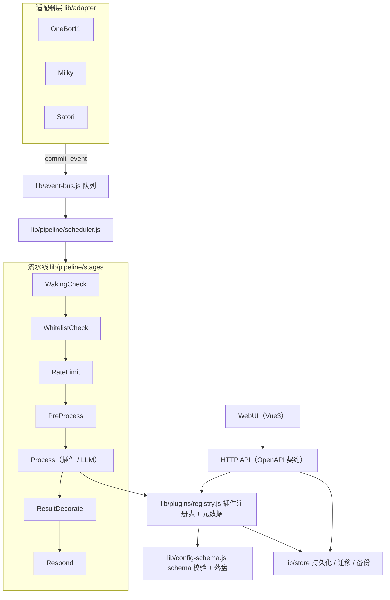

# Yunzai 改造总纲

| 项 | 值 |
|---|---|
| 状态 | 阶段 0-4 ✅、阶段 5 主体完成（剩两项刻意挂起，见 §9）；阶段 6 未开工。**进度以 §9 为准** |
| 开发仓 | `E:\ProjectCollection\2026_9\Work\Yunzai` |
| 参考仓（只读） | `E:\ProjectCollection\2026_9\Own\Yunzai`（完整上游历史） |
| 基线 | `trss-yunzai` 3.1.3 @ upstream `69d5b3a` |
| 参考实现 | AstrBot，`E:\ProjectCollection\2026_9\Work\AstrBot` |
| 兼容底线 | 采纳先进设计，但对重要插件保留兼容层/适配 |

本文档是总入口。各阶段的可执行细节放在同目录下的分册文档中，每份文档自带验收标准与勾选清单。

---

## 0. 文档导航

| 文档 | 主题 | 阶段 |
|---|---|---|
| [`00-prep.md`](./00-prep.md) | 前期准备：仓库、分支、工具链、CI 骨架 | 阶段 0 |
| [`01-plugin-contract.md`](./01-plugin-contract.md) | 插件契约：元数据、配置 schema、能力声明 | 阶段 1 |
| [`02-pipeline.md`](./02-pipeline.md) | 消息流水线：Stage 有序链、事件总线、上下文 | 阶段 2 |
| [`03-engineering.md`](./03-engineering.md) | 工程化：CI、测试、类型检查、提交规范 | 阶段 3 |
| [`04-message-adapter.md`](./04-message-adapter.md) | 统一消息组件、适配器抽象、会话唯一键 | 阶段 4 |
| [`05-persistence-config.md`](./05-persistence-config.md) | 持久化迁移策略、配置版本化、备份 | 阶段 5 |
| [`06-webui.md`](./06-webui.md) | WebUI 与 OpenAPI 契约 | 阶段 6 |
| [`07-ai-capabilities.md`](./07-ai-capabilities.md) | Provider / Agent / 知识库等 AI 能力 | 阶段 7（按需） |
| [`baseline/static-analysis.md`](./baseline/static-analysis.md) | 静态分析基线：ESLint / 类型检查 / 测试的真实结果与缺陷清单 | 阶段 0 产出 |
| [`baseline/startup.md`](./baseline/startup.md) | 启动基线：冷/热启动耗时、插件与适配器数量、运行期观测 | 阶段 0 产出 |
| [`99-compat-and-migration.md`](./99-compat-and-migration.md) | 兼容层设计与破坏性变更登记 | 贯穿全程 |
| [`dev-notes.md`](./dev-notes.md) | 开发笔记：工具链与终端陷阱、本地绿而 CI 红的原因、真机验证纪律、文档同步检查单 | 贯穿全程 |

---

## 1. 背景与目标

Yunzai 的插件生态非常成熟（`plugins/adapter`、`plugins/system`、`plugins/other` 加上社区生态），但内核一年多来基本定型：横切逻辑硬编码在核心加载器里、插件调度依赖优先级魔数、工程化基础设施近乎为零。AstrBot 在"横切关注点分层"和"插件契约化"上做到了可直接借鉴的程度。

**本次改造的目标：**

1. 让**横切策略**（唤醒/鉴权/限流/安全/装饰/发送）从核心代码中剥离为可插拔的 `Stage`；
2. 让**插件契约**具备元数据、配置 schema、版本与平台能力声明，宿主可校验、可渲染表单；
3. 让**消息模型与适配器**从"约定驱动"变为"显式抽象"，支撑多适配器与多账号实例；
4. 让**工程化**从 0 到 1：测试、CI、类型检查、提交规范；
5. 全程**不破坏**重点插件（`miao-plugin` 等），旧 API 通过适配层继续可用。

**非目标（明确排除）：**

- 不重写插件生态、不迁移插件语言（保持 Node/ESM）；
- 不引入 TypeScript 全量重写（采用 `checkJs` + JSDoc 渐进式）；
- 不替换 sequelize / express / puppeteer 等现有基础设施；
- 阶段 7 的 AI 能力属于按需扩展，前 6 阶段不依赖它。

---

## 2. 现状诊断（附证据）

| # | 问题 | 证据 | 影响 |
|---|---|---|---|
| 1 | 横切逻辑硬编码在核心 | `lib/plugins/loader.js` 的 `deal()` 里顺序写死：`checkBlack` → `getGroup` → `checkLimit` → `dealEvent` → `setLimit` → `reply` → `Runtime.init` → 优先级环 | 任何新策略都要改核心文件，插件无法介入 |
| 2 | 插件调度依赖优先级魔数 | `lib/plugins/handler.js`：`events[key].sort((a, b) => a.priority - b.priority)`；且 `Handler.callAll` 已被注释禁用 | 执行顺序隐式、难调试；短路靠 `reject()` 回调 |
| 3 | 插件契约贫弱 | `lib/plugins/plugin.js` 构造函数仅有 `name / dsc / handler / namespace / event / priority / task / rule` | 无配置 schema、无版本约束、无平台声明、无 i18n |
| 4 | 适配器抽象薄弱 | `lib/bot.js` 中 `adapter` 是数组 + 自定义 `push` 做 `path` 去重 | 新增适配器靠约定，无能力表 |
| 5 | 无类型 / 无测试 / 无 CI | 无 `tsconfig.json` 或 `jsconfig.json`；无 `tests/`；仓库无 `.github/`；`package.json` 的 `lint` 是 `prettier --write`（写文件而非校验） | 重构没有安全网，无法在 CI 拦截回归 |
| 6 | 配置无版本与迁移 | `lib/config/init.js` 逻辑仅为"默认配置目录缺文件则复制" | 配置结构升级易踩坑，无回滚 |
| 7 | WebUI 缺位 | `lib/tools/web.js` 是 art-template 渲染调试页，仅用于查看 `temp/ViewData` | 无运维界面（配置、日志、插件管理） |
| 8 | 状态与全局强耦合 | `app.js` 设置 `global.Bot`，`lib/config/config.js` 用 Proxy 把未知属性名映射成配置读取 | 单测困难，隐式行为多 |

---

## 3. 设计原则

1. **契约先行**：先定义"插件怎么写、消息怎么流"，再写实现。契约未定前不写业务代码。
2. **适配而非重写**：新机制与旧机制并存，用适配层桥接，旧插件零改动可跑。
3. **每一步可独立发布、可回滚**：每个阶段结束时主干都可用，禁止长期分支。
4. **KISS**：不引入用不上的抽象与依赖；一个改动只解决一个问题。
5. **闸门随阶段落地**：该阶段新增的代码必须有对应测试与 CI 检查，不允许"以后再补"。
6. **可对照上游**：任何时刻都能 `git diff upstream/main` 看清改了什么。

---

## 4. 目标架构

对照现状的关键变化：`loader.deal()` 从"流程本身"降级为"流水线的调度入口"；`Handler` 优先级环被 `Process` 段内的注册表取代；`Bot` 全局对象保留为兼容外观，但新代码通过 `PipelineContext` 取依赖。

---

## 5. 阶段路线图

| 阶段 | 主题 | 分册 | 核心产出 | 验收信号 | 状态 |
|---|---|---|---|---|---|
| 0 | 前期准备 | `00-prep.md` | 仓库基线、分支模型、lint/format 闸门、CI 骨架、`AGENTS.md` | CI 绿灯；`pnpm lint` 为只读校验 | ✅ 完成（延期的「真实触发 CI」已于 2026-09-24 补上） |
| 1 | 插件契约 | `01-plugin-contract.md` | `plugin.json` 元数据、`config.schema.json`、权限/平台/版本声明、旧基类自动合成 | 3 个内置插件完成迁移且行为不变 | ✅ 完成 |
| 2 | 流水线 | `02-pipeline.md` | `Stage` 有序链 + `Scheduler` + `PipelineContext` + `EventBus` | `deal()` 各步骤全部下沉为 Stage，旧插件无感 | 🚧 9 个 Stage + `EventBus` 已切换并真机验证；剩第 5 步（清理旧路径） |
| 3 | 工程化 | `03-engineering.md` | vitest 单测、`checkJs`、ESLint、husky + commitlint、覆盖率 | 核心模块覆盖率 ≥ 60% | ✅ 完成（覆盖率 95.22%；ESLint 与 typecheck 均已归零并转阻塞；共 355 个单测；CI 四条矩阵腿全绿） |
| 4 | 消息与适配器 | `04-message-adapter.md` | `Component` 抽象、适配器注册表与能力表、会话唯一键 `umo` | Milky/Satori 走同一组件路径 | ✅ 完成（v1/v2/v3 均落地；`umo` 已用于限流键，`conKey` 与 Runtime 的会话键留给阶段 5；能力表已声明 2 个适配器） |
| 5 | 持久化与配置 | `05-persistence-config.md` | 幂等迁移、`config_version`、结构化备份导出 | 老配置/老库可自动升级并可回滚 | 未开始 |
| 6 | WebUI | `06-webui.md` | Vue3 运维面板、OpenAPI 契约与客户端生成 | 可在 UI 内改配置并热生效 | 未开始 |
| 7 | AI 能力 | `07-ai-capabilities.md` | Provider 注册表、Agent 循环、知识库 RAG | 按需启动，不作为前置依赖 | 未开始 |

阶段 1 与阶段 2 顺序不可交换：契约决定了 Stage 如何取插件信息。阶段 3 可提前部分落地（CI 骨架在阶段 0），但完整测试在阶段 2 之后性价比最高。

---

## 6. 兼容性策略（三层）

| 层 | 内容 | 策略 |
|---|---|---|
| **L0 冻结层** | `global.Bot`、`global.plugin`、`global.segment`、`plugin` 基类构造参数、`e.reply()`、`e.msg` 等插件高频 API | **永久保留，不做破坏性变更** |
| **L1 适配层** | 新契约 ↔ 旧契约双向转换（旧 `rule` 自动转新注册项；新 schema 自动反映为 `cfg.getGroup` 可见字段） | 新增代码，不改动旧行为 |
| **L2 新契约** | `plugin.json` 元数据、`config.schema.json`、显式 `Stage` 扩展点、`Component` 消息模型 | 新插件与内核新代码使用 |

`package.json` 中的 `imports` 子路径（`#miao`、`#miao.models`）属于 L0 冻结范围——`lib/plugins/plugin.js` 会动态 `import("#miao")` 取 `Common`，该映射不能删除。重点插件清单与迁移记录见 [`99-compat-and-migration.md`](./99-compat-and-migration.md)。

---

## 7. 风险与对策

| 风险 | 概率 | 影响 | 对策 |
|---|---|---|---|
| 上游同步成本上升 | 高 | 中 | 保留 `upstream` 只读远端 + 记录基线 commit；每个阶段结束做一次基线重同步评审 |
| 兼容层越积越厚，形成两套体系 | 中 | 高 | 兼容层只做单向适配且不含业务逻辑；每阶段在 `99-...` 登记并设定淘汰条件 |
| 流水线改造导致消息顺序/时序变化 | 中 | 高 | 阶段 2 引入前后各跑一次全量回归（用录制的事件样本做金标准对比） |
| 缺少测试导致重构回归 | 高 | 高 | 阶段 0 先上 CI 骨架；阶段 2 之前为核心模块补最小单测 |
| 改造范围蔓延到插件生态 | 中 | 中 | 严格遵守"非目标"清单；插件迁移只做 3 个内置插件作为样板 |
| 无类型系统下重构语义漂移 | 中 | 中 | 阶段 3 的 `checkJs` + JSDoc 作为阶段 4/5 的前置 |

---

## 8. 决策记录（ADR）

| 编号 | 决策 | 备选方案 | 结论与理由 |
|---|---|---|---|
| ADR-001 | 仓库策略 | 直接改 `Own\Yunzai` / clone 保留历史 / 复制后重开仓 | **复制代码后重新 `git init`**。上游历史通过 `upstream` 远端与 `Own\Yunzai` 参考仓保留，开发仓历史干净可控 |
| ADR-002 | 文档组织 | 单文件 / 多分册 | **多分册**。阶段之间独立推进，单文件会迅速膨胀且难以勾选进度 |
| ADR-003 | 兼容性底线 | 零破坏 / 完全自由 | **先进优先 + 重要插件保留兼容层**。内核可演进，`miao-plugin` 等重点插件必须无感 |
| ADR-004 | 类型策略 | 全量 TS 重写 / 保持 JS / JSDoc + `checkJs` | **JSDoc + `checkJs` 渐进式**。避免一次性重写带来的巨大 diff 与兼容风险 |
| ADR-005 | 语言与运行时 | — | 保持 Node ESM，不引入构建步骤到运行路径（与上游一致） |
| ADR-006 | 锁文件策略 | 跟踪 `pnpm-lock.yaml` / 保持忽略 | **保持忽略**，改为把 `devDependencies` 写成精确版本。理由：`pnpm-workspace.yaml` 的 `packages` 含 `plugins/**`，用户增删插件会持续改动锁文件；跟踪它会让每个用户的仓库始终处于 dirty 状态。代价是运行时依赖的 `^` 范围不固定，需要时再用 `pnpm.overrides` 逐个锁定 |
| ADR-007 | CI 冒烟测试时机 | 阶段 0 做启动冒烟 / 推迟 | **推迟到阶段 2**。阶段 0 无可行的启动方式：`Bot.run()` 会拉起 redis、初始化 puppeteer、等待适配器上线，CI 中无真实账号会挂起；且没有适配器在线时插件栈不会被加载。阶段 2 的假适配器 + fake 事件夹具就位后再做 |
| ADR-008 | 洋葱模型与 workflow 引擎 | 实现洋葱 / 采纳 AstrBot RFC #1948 的 workflow 引擎 / 两者都不做 | **两者都不做，只保留有序链**。① 洋葱在 Yunzai 里零消费者（原计划只有 `StatisticsStage` 计时，而那是调度器职责）；② 参考实现自己正用 chain 架构**替代**洋葱模型（[#1948](https://github.com/AstrBotDevs/AstrBot/issues/1948)），其完整 workflow 引擎属 v5.x milestone 且 PR 仍为 WIP，自列已知问题包括“内置命令重新设计”“WebUI 重构”——对 Yunzai 等于重写插件生态；③ 参考实现的洋葱调度器会让下游执行两遍。扩展点保留：Stage 是行为唯一单元，顺序决策只在 `stage-order.js` 与 `scheduler.js` 两处 |

---

## 9. 进度总表

- [x] 阶段 0-1：建立开发仓基线，校验与上游一致
- [x] 阶段 0-2：工具链与 CI 骨架（见 `00-prep.md`）
- [x] 阶段 0-3：标定与诊断基线（启动基线已采集；事件 fixture 改为阶段 2 前置任务）
- [x] 阶段 1：插件契约（`plugin.json` + 受控 schema + 版本闸门 + 契约注入）
- [x] 阶段 2：流水线（**第 5 步「清理旧路径」已于 2026-09-24 完成**：`deal()` / `dealEvent()` /
      `checkLimit()` / `setLimit()` / `onlyReplyAt()` 与 `bot.legacy_pipeline` 开关均已删除，
      `lib/event-bus.js` 只剩一条路径；旧侧用例退役，行为基线转由
      `tests/fixtures/pipeline/baseline-snapshots.json` 守卫，见 `02-pipeline.md` §7.1）
- [x] 阶段 3：工程化（覆盖率 95.22% + `smoke.yml` + ESLint 0/0 与 typecheck 0 处均已入 CI 并阻塞；
      首次真实 CI 曾四条矩阵腿全挂在 typecheck，根因是 `#miao` 的环境依赖，
      修完后四条腿全绿，见 `03-engineering.md` §3.6/§5）
- [x] 阶段 4：消息与适配器（v1 统一组件模型、v2 `umo` 会话键、v3 适配器注册表与能力表，见 `04-message-adapter.md`；
      已在真机上浸泡过群聊与私聊路径，`[ERRO]` 0 条）
- [x] 阶段 5：持久化与配置（**主体已完成**（2026-09-24）：§3.1 配置版本化 / 幂等迁移 / 迁前备份
      （2 个真实迁移，真实配置已在 `config_version: 2`）、§3.2 的 `config:diff`、
      §3.3 的 redis 键前缀规范（`Yz:cache:` / `Yz:persist:` + 守卫测试）、
      §3.4 的 `backup` / `restore`（自写 ZIP，外部工具验过）均已落地。
      **未完成两项**：① `sequelize` / `sqlite3` 的删除——按 BCR-0001 等两个发布版本，刻意挂起；
      ② §3.2 的宿主配置 schema 化（`config/host.schema.js`）——下游只有阶段 6 的 WebUI 表单，
      与阶段 6 一起做。见 `05-persistence-config.md` §6）
- [ ] 阶段 6：WebUI（**后端已完成**，见 `06-webui.md`：安全基座、就绪探针、五个接口（含 SSE 日志流）、
      `docs/openapi.yaml` 契约与一致性测试；三处偏离已登记）。
      **`dashboard/` 前端已委托给另一个 agent —— 交接单在 `06-webui.md` §7**）
- [ ] 阶段 7：AI 能力（按需）
